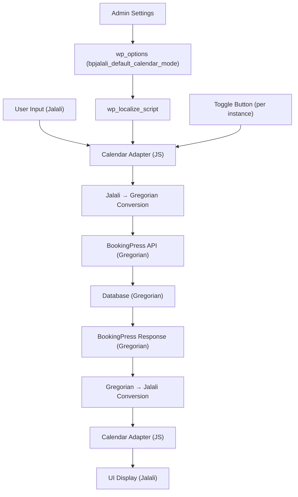

# BookingPress Jalali — Implementation Plan

## Source Analysis Summary

### BookingPress Architecture (Read-Only Reference)
- **Frontend Calendar**: Uses `v-calendar` Vue component for date picking
- **Date Formats**: Converts between PHP date formats and moment.js-style formats (`MMMM D, YYYY`, `YYYY-MM-DD`, etc.)
- **JS Libraries**: Vue 2, Element UI, Moment.js, v-calendar, Axios
- **Hooks System**: WordPress `wp.hooks` (JS-side), `do_action`/`apply_filters` (PHP-side)
- **Date Storage**: Gregorian dates in `Y-m-d` format in the database
- **Key Extension Points**:
  - `bookingpress_add_frontend_js` — inject frontend JS
  - `bookingpress_front_booking_form_load_before` — before form loads
  - `bookingpress_add_dynamic_details_booking_shortcode` — modify shortcode data
  - `bookingpress_{module}_dynamic_data_fields` — inject Vue data
  - `bookingpress_{module}_dynamic_vue_methods` — inject Vue methods
  - `bookingpress_{module}_dynamic_on_load_methods` — inject onLoad logic
  - `bookingpress_{module}_dynamic_helper_vars` — inject helper variables
  - JS `wp.hooks` filters like `bookingpress_change_calendar_url`

---

## Phase 1: Plugin Skeleton & Calendar Engine

### 1.1 Plugin Bootstrap
- [x] Create `bookingpress-jalali.php` (main plugin file)
- [x] WordPress plugin header
- [x] ABSPATH guard
- [x] BookingPress dependency check (graceful fail)
- [x] Constants: `BPJALALI_VERSION`, `BPJALALI_DIR`, `BPJALALI_URL`
- [x] Autoloader or direct includes
- [x] Plugin activation/deactivation hooks
- [x] Settings registration (default calendar mode = `jalali`)

### 1.2 Jalali Calendar Engine (Pure PHP)
- [x] `includes/class-bpjalali-calendar-engine.php`
- [x] Accurate Jalali ↔ Gregorian conversion (using reliable algorithm)
- [x] Jalali leap year detection (33-year cycle algorithm)
- [x] Month lengths, year boundaries, Farvardin 1, Esfand 29/30
- [x] Date validation
- [x] Format output (English month names: `Farvardin`, `Ordibehesht`, etc.)

### 1.3 Jalali Calendar Engine (JavaScript)
- [x] `assets/js/bpjalali-calendar-engine.js`
- [x] Same algorithm ported to JavaScript
- [x] Pure functions, no DOM dependency
- [x] `gregorianToJalali(gy, gm, gd)` → `[jy, jm, jd]`
- [x] `jalaliToGregorian(jy, jm, jd)` → `[gy, gm, gd]`
- [x] `isJalaliLeapYear(jy)` → boolean
- [x] `jalaliMonthLength(jy, jm)` → number
- [x] `formatJalaliDate(jy, jm, jd, format)` → string
- [x] Month/weekday name lookups (English)

---

## Phase 2: Admin Settings & Integration Layer

### 2.1 Admin Settings Page
- [x] `includes/class-bpjalali-admin.php`
- [x] Add settings under WordPress admin menu or BookingPress settings
- [x] Default calendar mode option: `jalali` | `gregorian`
- [x] Store in `wp_options` with prefix `bpjalali_`

### 2.2 PHP Integration Layer
- [x] `includes/class-bpjalali-integration.php`
- [x] Hook into BookingPress PHP filters to convert dates for display
- [x] Pass calendar mode & settings to frontend via `wp_localize_script`

### 2.3 Frontend Integration
- [x] `includes/class-bpjalali-frontend.php`
- [x] Enqueue JS/CSS after BookingPress scripts
- [x] Hook into `bookingpress_add_frontend_js`
- [x] Pass Jalali config data to frontend

---

## Phase 3: Frontend Calendar Adapter

### 3.1 Calendar Adapter JS
- [x] `assets/js/bpjalali-adapter.js`
- [x] Intercept BookingPress calendar rendering
- [x] Override v-calendar date display with Jalali dates
- [x] Handle month/year navigation in Jalali mode
- [x] Convert user-selected Jalali dates back to Gregorian for submission
- [x] Per-instance calendar mode state (not global)
- [x] Calendar toggle button (Jalali ↔ Gregorian)

### 3.2 CSS Styling
- [x] `assets/css/bpjalali-style.css`
- [x] Minimal styling for toggle button
- [x] Match BookingPress typography/spacing/colors
- [x] RTL-aware (Persian text direction)

---

## Phase 4: Testing

### 4.1 PHP Unit Tests
- [ ] Jalali leap years (known leap/non-leap years)
- [ ] Month boundaries
- [ ] Farvardin 1 mapping
- [ ] Esfand 29/30 handling
- [ ] Round-trip conversions
- [ ] Invalid date handling

### 4.2 JS Unit Tests
- [ ] Same coverage as PHP tests
- [ ] Calendar mode switching
- [ ] Date format output

---

## Architecture Diagram



---

## File Structure

```
bookingpress-jalali/
├── bookingpress-jalali.php          # Main plugin entry
├── includes/
│   ├── class-bpjalali-calendar-engine.php   # Pure Jalali calculations (PHP)
│   ├── class-bpjalali-admin.php             # Admin settings
│   ├── class-bpjalali-frontend.php          # Frontend hooks & enqueue
│   └── class-bpjalali-integration.php       # BookingPress integration layer
├── assets/
│   ├── js/
│   │   ├── bpjalali-calendar-engine.js      # Pure Jalali calculations (JS)
│   │   └── bpjalali-adapter.js              # BookingPress calendar adapter
│   └── css/
│       └── bpjalali-style.css               # Minimal styling
├── languages/
│   └── bookingpress-jalali.pot              # Translation template
└── tests/
    ├── test-calendar-engine.php             # PHP calendar tests
    └── test-calendar-engine.js              # JS calendar tests
```

> [!IMPORTANT]
> This plan implements Phase 1-3 (full working plugin). Phase 4 (formal test suites) will follow.
